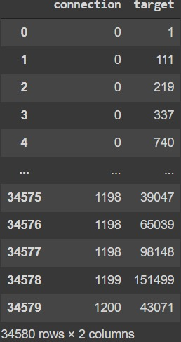
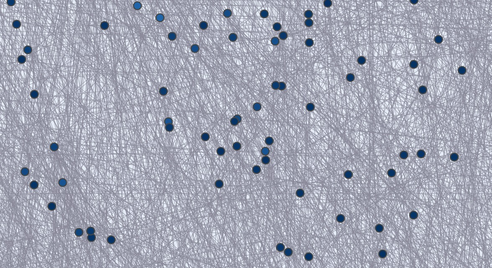
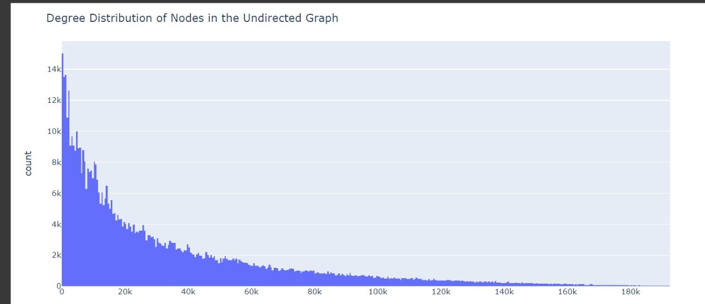

# Network_Security_Project
Visualize the internet architecture
We used Google Colab to create this project

## Configuration Instructions
Navigate to Google Colab, and signup to start working with Colab
Create new notebook and name it
Upload the dataset file into the environment to the below path
##### /content/routers_data_undirected

After all the configurations are set, we are ready to visualize the data

## Installation Instructions
We need to import all the below packages before visualizing the data
1. pandas
2. networkx
3. plotly.graph_objects

After installing the necessary packages, we follow the below steps
1. creating a new graph object
2. We use the 'from_pandas_edgelist()' function from networkx package to read the dataset.
3. We limited the nodes to 1200 in order to avoid complexity issues.
4. We create nodes and edges and add it to our graph object.
5. We get the positions of nodes and use the random_layout defined in networkx package to plot our graph.
6. Using plotly we create edge traces based on weights and a single node trace for all the nodes.
7. We colored the nodes and edges using scatter attributes. Nodes with higher connections have a lighter color in our graph.
8. Finally using plotly fig() function we generated a graph with properties like width of the connection, color, hover info, mode of the connected line
9. We implemented weighted edges between nodes.
10. We show details like node_id, number of neighbouring nodes, number of node connections when we hover over each node.
11. We generated a html file for our output graph for ease of accessibility.

#Histogram
1. We used a plotly module called express to plot our histogram
2. This time we read the entire dataset and plot a figure for all the nodes using histogram() function.

Our code generates the following outputs
1. TWe print a dataframe \t
  
2. Our network graph
  
3. Our Histogram
   

## Video
https://user-images.githubusercontent.com/60381430/161347900-54b8ca4f-2cd4-4e39-96ba-6434d54a2262.mp4

## Contributions
| Range | Name - Rid |
| ---  | --- |
|0 to 200 |     Lohith Bhargav Doppalapudi - R11786637
|201 to 400 |   Deepika Duttaluru Muralidhar - R11798788
|401 to 600  |    Bala Naga Sai Chandu Thutupalli - R11800450
|601 to 800    |     Dharani Kumar Vemuri - R11804262
|801 to 1000    |     Rajani Priya Danda - R11800015
|1001 to 1200 |   Harshini Vemula - R11800661

## Contact for Authors
| Name | Rid |
| --- | --- |
|Lohith Bhargav Doppalapudi | R11786637 |
|Deepika Duttaluru Muralidhar | R11798788 |
|Bala Naga Sai Chandu Thutupalli | R11800450 |
|Dharani Kumar Vemuri | R11804262 |
|Rajani Priya Danda | R11800015 |
|Harshini Vemula | R11800661 |
